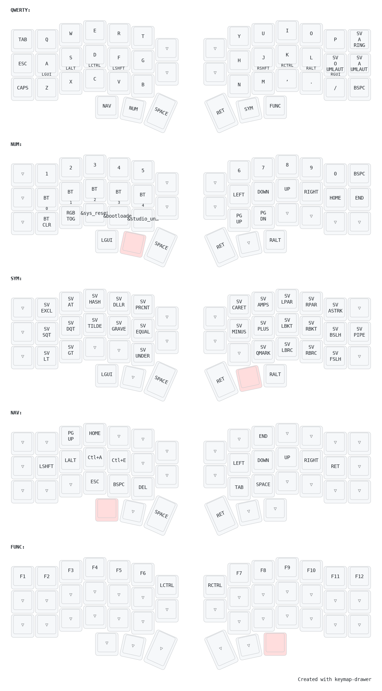

My zmk config for my keyboards from keebart.com





https://keymap-drawer.streamlit.app


# Piantor Pro BT Combo Reference

This is a reference list of all key combinations (combos) defined for the Piantor Pro BT keyboard using ZMK firmware with the QWERTY base layer and Swedish locale (`locale/keys_sv.h`). Each combo is triggered by pressing two keys simultaneously on the base layer (`layer 0`) with a 50ms timeout. These combos are designed for ergonomic use (horizontal adjacent fingers or thumb + finger, no same-finger verticals) and output symbols relevant for Java, Python, and Bash development.

| Symbol | Keys to Press | Key Positions | Description |
|--------|---------------|---------------|-------------|
| `!` | `Z + X` | `<25 26>` | Exclamation mark |
| `?` | `M + ,` | `<31 32>` | Question mark |
| `#` | `Q + W` | `<1 2>` | Hash sign |
| `$` | `C + N` | `<27 30>` | Dollar sign |
| `@` | `T + Y` | `<5 6>` | At sign |
| `=` | `S + D` | `<14 15>` | Equals sign |
| `|` | `. + -` | `<33 34>` | Pipe |
| `&` | `K + L` | `<20 21>` | Ampersand |
| `'` | `E + R` | `<3 4>` | Apostrophe |
| `"` | `U + I` | `<7 8>` | Quotation mark |
| `(` | `A + S` | `<13 14>` | Left parenthesis |
| `)` | `L + Ö` | `<21 22>` | Right parenthesis |
| `[` | `D + F` | `<15 16>` | Left bracket |
| `]` | `J + K` | `<19 20>` | Right bracket |
| `{` | `F + G` | `<16 17>` | Left curly brace |
| `}` | `H + J` | `<18 19>` | Right curly brace |
| `<` | `X + C` | `<26 27>` | Less than |
| `>` | `, + .` | `<32 33>` | Greater than |
| `*` | `B + N` | `<29 30>` | Asterisk |
| `%` | `C + V` | `<27 28>` | Percent sign |
| `/` | `N + M` | `<30 31>` | Forward slash |
| `\` | `V + B` | `<28 29>` | Backslash |
| `+` | `G + H` | `<17 18>` | Plus sign |
| ``` | `I + O` | `<8 9>` | Grave accent |
| `~` | `O + P` | `<9 10>` | Tilde |

## Notes
- **Key Positions**: Refer to the `default_map` in `piantor_pro_bt-layouts.dtsi` for the physical key layout.
- **Swedish Locale**: Uses macros like `SV_SQT`, `SV_DQT`, `SV_EXCL`, etc., from `locale/keys_sv.h` to ensure correct symbol output on a Swedish keyboard layout.
- **Ergonomics**: Combos are designed for horizontal adjacent fingers (e.g., `J + K`) or thumb + finger (e.g., `V + SPC`) to avoid same-finger vertical presses.
- **Testing**: Use a text editor or keyboard tester to verify outputs. Ensure your system is set to a Swedish keyboard layout for correct symbol rendering.
- **Home-Row Mods**: Combos like `S + D` and `A + S` involve home-row mod keys. The 50ms timeout helps distinguish them from hold-tap behaviors, but adjust `timeout-ms` if needed.

## QWERTY Base Layer with Combos
