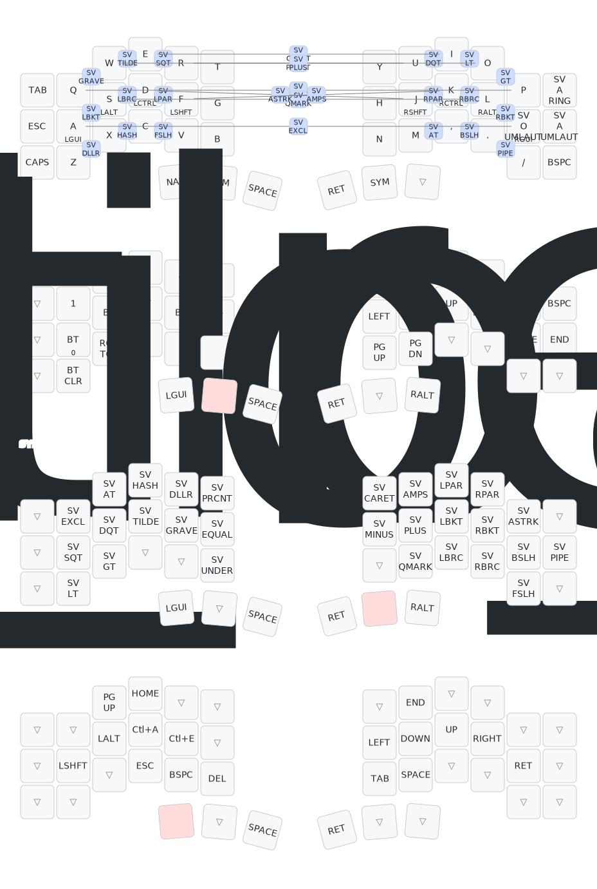

My zmk config for my keyboards from keebart.com

# The corne layout

# My piantor layout

https://keymap-drawer.streamlit.app

# My ZMK Config for Keyboards from Keebart.com

[Keymap Drawer](https://keymap-drawer.streamlit.app)

This repository contains my custom ZMK firmware configurations for ergonomic split keyboards like the Piantor Pro BT and Corne Pro BT (or similar variants like Corne 4.1). The keymaps are optimized for QWERTY with Swedish locale support (`locale/keys_sv.h`), focusing on programming symbols for Java, Python, and Bash development. I've recently updated the combos to a new chorded system for better ergonomics and efficiency.

## New Combo System

I've developed a new combo system using chorded key presses (pressing two keys simultaneously within a 50ms timeout). This replaces the previous mappings with a more intuitive, visualization-friendly approach. Combos are divided into single-side (same hand) and dual-side (both hands) for balanced use.

### Design Philosophy
- **Single-Side Combos**: Use keys from the same hand for paired or isolated symbols (e.g., brackets, quotes). Reduces stretching and allows one-handed input.
- **Dual-Side Combos**: Span both hands for operators and punctuation, encouraging deliberate, balanced typing.
- **Key Selection**: Based on adjacent QWERTY pairs (e.g., "qw" for Q+W). Swedish keys like ö are integrated naturally.
- **Unused Slots ("nop")**: Some dual-side combos are left unmapped for now, to avoid accidents or for future use.
- **Ergonomics**: Prioritizes home-row and adjacent fingers; no same-finger verticals. Timeout is 50ms—adjust if needed.
- **Compatibility**: Works on base layer (0). For Swedish macOS users, set input source to U.S. (System Settings > Keyboard > Input Sources) to fix issues like `[` rendering as Å.

### How to Use
1. Press the two keys in the combo nearly simultaneously.
2. No modifiers needed—these are pure combos.
3. Test in a text editor after flashing.
4. Customize in the `.keymap` file's `combos` section.

### Combo Visualization
Tables show key pairs (e.g., "qw") and triggered symbols (e.g., "`"). "split" separates left/right hands.

### Single-Side Combos

| Left Hand       |               |               | Split | Right Hand      |               |               |    |
|-----------------|---------------|---------------|-------|-----------------|---------------|---------------|----|
| qw("`")         | we("~")       | er("'")        |       | ui("\"")        | io("<")       | op(">")       |    |
| as("[")         | sd("{")       | df("(")        |       | jk(")")         | kl("}")       | lö("]")       |    |
| zx("$")         | xc("#")       | cv("/")        |       | m,("@")         | ,.( "\\")     | .-("\|")      |    |

---

### Dual-Side Combos

| Top Row         |               |               |               |
|-----------------|---------------|---------------|---------------|
| qp("=")         | wo("%")       | ei("^")       | ru("+")       |
| aö("!")         | sl("?")       | dk("&")       | fj("*")       |

---

### Piantor Pro BT Combo Reference (Updated)

These combos apply to the Piantor Pro BT using the new system. Key positions are from `piantor_pro_bt-layouts.dtsi` (`default_map`).

| Symbol | Keys to Press | Key Positions | Description            |
|--------|---------------|---------------|------------------------|
| \`     | Q + W         | <1 2>         | Grave accent           |
| ~      | W + E         | <2 3>         | Tilde                  |
| '      | E + R         | <3 4>         | Single quote           |
| [      | A + S         | <13 14>       | Left square bracket    |
| {      | S + D         | <14 15>       | Left curly brace       |
| (      | D + F         | <15 16>       | Left parenthesis       |
| $      | Z + X         | <25 26>       | Dollar sign            |
| #      | X + C         | <26 27>       | Hash sign              |
| /      | C + V         | <27 28>       | Forward slash          |
| "      | U + I         | <7 8>         | Double quote           |
| <      | I + O         | <8 9>         | Less-than sign         |
| >      | O + P         | <9 10>        | Greater-than sign      |
| )      | J + K         | <19 20>       | Right parenthesis      |
| }      | K + L         | <20 21>       | Right curly brace      |
| ]      | L + Ö         | <21 22>       | Right square bracket   |
| @      | M + ,         | <31 32>       | At sign                |
| \\     | , + .         | <32 33>       | Backslash              |
| \|     | . + -         | <33 34>       | Pipe                   |
| =      | Q + P         | <1 10>        | Equals sign            |
| %      | W + O         | <2 9>         | Percent sign           |
| ^      | E + I         | <3 8>         | Caret                  |
| +      | R + U         | <4 7>         | Plus sign              |
| !      | A + Ö         | <13 22>       | Exclamation mark       |
| ?      | S + L         | <14 21>       | Question mark          |
| &      | D + J         | <15 19>       | Ampersand              |
| *      | F + K         | <16 20>       | Asterisk               |

## Notes
- **Key Positions**: Refer to the `default_map` in your keyboard's `.dtsi` file for exact layout.
- **Swedish Locale**: Uses macros like `SV_SQT`, `SV_DQT`, etc., from `locale/keys_sv.h`. Set OS to U.S. input for consistent symbols.
- **Ergonomics**: Horizontal adjacent fingers or thumb + finger; no same-finger verticals.
- **Testing**: Verify in a text editor with Swedish keyboard layout enabled.
- **Home-Row Mods**: Combos like `as` involve mods; 50ms timeout distinguishes from hold-taps—adjust if needed.
- **Changes from Old System**: New mappings are more symmetric and visualization-based; old ones (e.g., D+F for ()) are replaced for better flow.

For full configs, see the `.keymap` files. Contributions or issues welcome!
